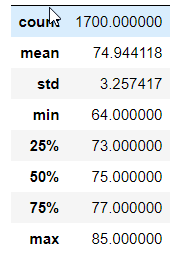
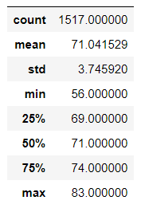

# SURF'S UP

## Overview
Analyzing temperature data for the months of June and December in Oahu, in order to determine if the surf and ice cream shop business is sustainable in Hawaii year-round. 

### Purpose

The purpose of this project is to:

- Determine the Summary Statistics for June
- Determine the Summary Statistics for December

### Analysis

Data Source: Hawaii SQLite Database [Hawaii Database](hawaii.sqlite)

Software used: Python 3.7.6, Pandas, Jupyter Notebooks, SQLAlchemy, Numpy

Analysis Code: 
- Summary Statistics for June & December [Summary Statistics Code](SurfsUp_Challenge.ipynb)

### Results
The summary temperature statistics are shown in the tables below:

|June | December|
|-----|--------|
| | |

 

- The mean temperature in Oahu during the month of June is 74.94 F and during the month of December is 71.04 F. There is roughly 3-4 degree Farenheit difference between the average temperatures of the two months.

- The maximum temperatures in the month of June and December are 85 F and 83 F respectively. The difference between the maximum temperatures in June and December is 2 degrees Farenheit. 

- The minimum temperatures in the month of June and December are 64F and 56 F respectively. The difference between the minimum temperatures of the two months is 8 degrees Farenheit. 

### Summary
[comment]: <> (There is a high-level summary of the results and there are two additional queries to perform to gather more weather data for June and December.)

